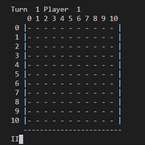

# alpha-omok

| |알파제로|알파고|
|---|---|---|
|상대전적|100승|100패|
|초기 데이터|X|16만개의 기보|
|학습방법|자가대국|사전데이터 학습 후 자가대국|
|신경망|통합됨|가치망, 정책망|
|학습시간|3일(4TPU)|40일(48TPU)|

## 학습 환경
GCP 인스턴스
- CPU: 6 core
- RAM: 24GB
- GPU: Tesla V100

## 실행 예시

## Thanks to
- YBIGTA 15기 김정학
- YBIGTA 15기 송하룡
- YBIGTA 15기 조준흠
- YBIGTA 15기 최종문

## 참고자료
[Mastering Chess and Shogi by Self-Play with a General Reinforcement Learning Algorithm](https://arxiv.org/abs/1712.01815)
<https://github.com/suragnair/alpha-zero-general>
